<h1 align="center">嗨 👋，我是 Freedom-Hank</h1>

<!-- GitHub Stats -->

  
  <picture>
    <source srcset="./images/stats-dark.svg" media="(prefers-color-scheme: dark)" />
    <source srcset="./images/stats-light.svg" media="(prefers-color-scheme: light)" />
    
  </picture>
  

<!-- Top Languages -->

  <picture>
    <source srcset="./images/langs-dark.svg" media="(prefers-color-scheme: dark)" />
    <source srcset="./images/langs-light.svg" media="(prefers-color-scheme: light)" />
    
  </picture>
  

<!-- Streak Stats -->

  <picture>
    <source srcset="./images/streak-dark.svg" media="(prefers-color-scheme: dark)" />
    <source srcset="./images/streak-light.svg" media="(prefers-color-scheme: light)" />
    
  </picture>

