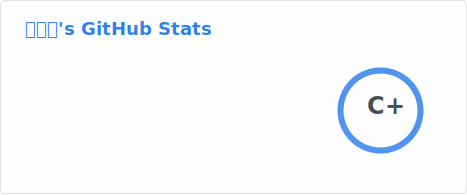
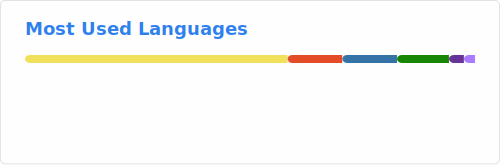

<h1 align="center">嗨 👋，我是 Freedom-Hank (吳承翰)</h1>

  <b>資工所碩士生 | AI Security & LLM Researcher | Python Developer</b> 
  <i>致力於大型語言模型安全性與自動化防禦技術研究</i>

  
  

---

### 🛡️ Cybersecurity & Research Focus
* **碩士研究**：基於遺傳演算法之 LLM 自動化紅隊演練架構 (Genetic-Red-Team)
* **技術背景**：**WSL2** 環境部署、**Ollama (Llama-3)** 本地端測試與 **GitHub Actions** 自動化
* **持續進修**：**HackerRank SQL (Basic) 5-Star 認證** 🌟 | **TryHackMe** 滲透測試演練中
### 🛠️ Tech Stack

---

<!-- GitHub Stats -->

  
  <picture>
    <source srcset="./images/stats-dark.svg" media="(prefers-color-scheme: dark)" />
    <source srcset="./images/stats-light.svg" media="(prefers-color-scheme: light)" />
    
  </picture>
  
<!-- 
 -->

<!-- Top Languages -->
<!-- 
 -->

  <picture>
    <source srcset="./images/langs-dark.svg" media="(prefers-color-scheme: dark)" />
    <source srcset="./images/langs-light.svg" media="(prefers-color-scheme: light)" />
    
  </picture>
  

<!-- Streak Stats -->

  <picture>
    <source srcset="./images/streak-dark.svg" media="(prefers-color-scheme: dark)" />
    <source srcset="./images/streak-light.svg" media="(prefers-color-scheme: light)" />
    
  </picture>

